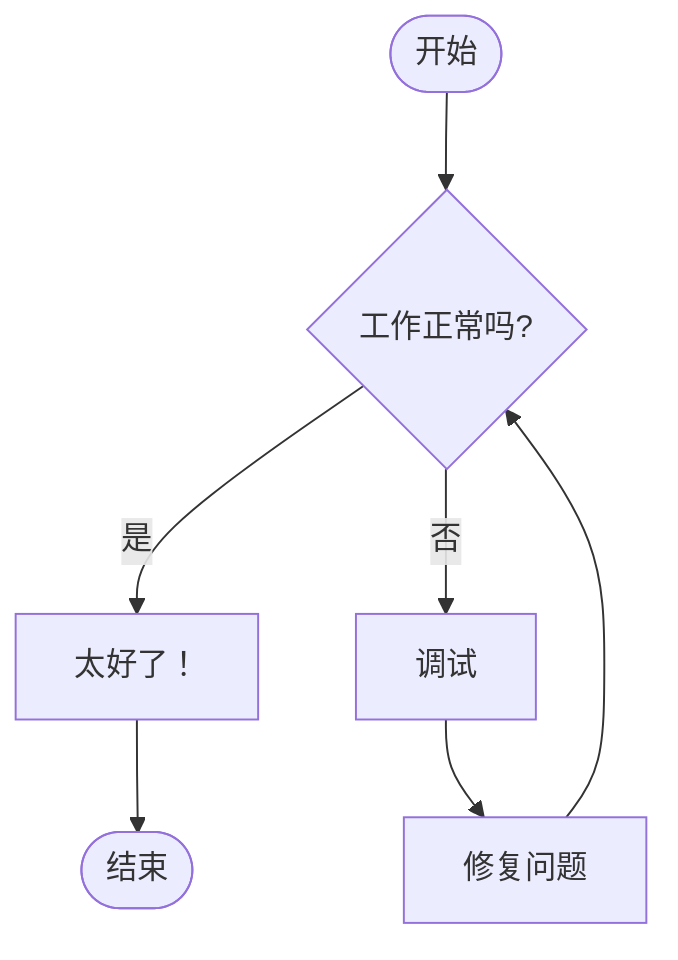
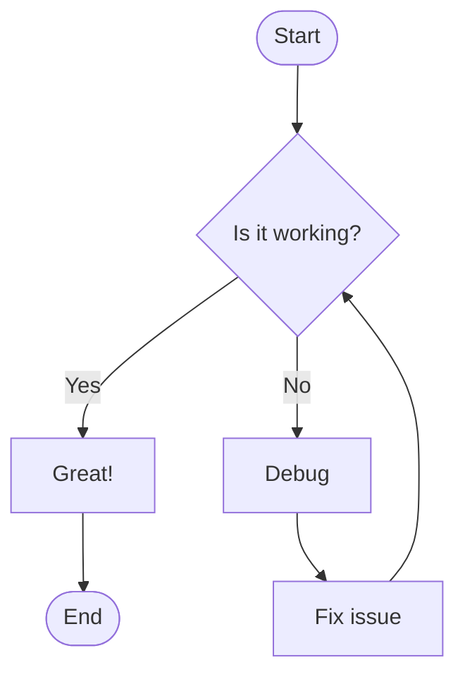

# 手绘风主题字体更新指南

## 🎨 更新内容

已将手绘风主题的字体更新为更可爱、更具手绘感的字体组合，支持中英文等多语言显示。

## ✨ 新字体组合

### 英文字体
1. **Gochi Hand** - 可爱的手写体，圆润活泼
2. **Indie Flower** - 手绘花体，自然随性
3. **Shadows Into Light** - 轻盈的手写体，优雅流畅

### 中文字体
1. **Ma Shan Zheng** (马善政楷书) - 手写楷书风格
2. **Long Cang** (龙藏体) - 书法手写风格
3. **Zhi Mang Xing** (志莽星) - 潇洒手写体

### 备用字体
- **cursive** - 系统默认手写体

## 📝 字体特点对比

### 原字体 (已替换)
- Caveat - 较细的手写体
- Patrick Hand - 工整的手写体
- Kalam - 印度风格手写体

### 新字体 (现在使用)
- **更可爱** - Gochi Hand 圆润的笔触更加可爱
- **更手绘** - Indie Flower 更自然的手绘感
- **更轻盈** - Shadows Into Light 笔触更轻快
- **中文支持更好** - 添加了专门的中文手写字体

## 🔧 修改的文件

### 1. `index.html`
添加了 Google Fonts 链接，引入新的手绘字体：

```html
<!-- Google Fonts - Hand-drawn & Cute Fonts -->
<link rel="preconnect" href="https://fonts.googleapis.com">
<link rel="preconnect" href="https://fonts.gstatic.com" crossorigin>
<link href="https://fonts.googleapis.com/css2?family=Gochi+Hand&family=Indie+Flower&family=Shadows+Into+Light&family=Architects+Daughter&family=Permanent+Marker&family=Patrick+Hand&family=Caveat:wght@400;600;700&family=Kalam:wght@300;400;700&family=Ma+Shan+Zheng&family=Long+Cang&family=Zhi+Mang+Xing&display=swap" rel="stylesheet">
```

### 2. `src/utils/themes.ts`
更新了 `handDrawn` 主题的字体配置：

**字体声明：**
```typescript
fontFamily: '"Gochi Hand", "Indie Flower", "Shadows Into Light", "Ma Shan Zheng", "Long Cang", "Zhi Mang Xing", cursive'
```

**字体大小调整：**
- 主字体：18px → **20px**（更大更可爱）
- 标题字体：22px → **24px**
- 边缘标签：16px → **18px**
- 图例字体：14px → **16px**

## 📊 字体应用范围

所有手绘风主题中的文本元素都使用新字体：

- ✅ 流程图节点
- ✅ 连接线标签
- ✅ 序列图角色和消息
- ✅ 类图标签
- ✅ 状态图标签
- ✅ ER 图实体和关系
- ✅ 甘特图
- ✅ 饼图
- ✅ Git 图
- ✅ XY 图表
- ✅ 集群/分组文本

## 🎯 效果展示

### 中文示例


### 英文示例


## 🌐 多语言支持

字体优先级从左到右：
1. 如果文本是英文 → 使用 Gochi Hand
2. 如果 Gochi Hand 不支持该字符 → 尝试 Indie Flower
3. 如果 Indie Flower 不支持 → 尝试 Shadows Into Light
4. 如果是中文字符 → 使用 Ma Shan Zheng
5. 如果 Ma Shan Zheng 不支持 → 尝试 Long Cang
6. 如果 Long Cang 不支持 → 尝试 Zhi Mang Xing
7. 最后使用系统默认的 cursive 字体

这样可以确保：
- 英文优先使用可爱的手写体
- 中文优先使用手写风格的中文字体
- 所有语言都能正常显示

## 🚀 使用方法

1. 在主题选择器中选择 **"Hand Drawn"** 主题
2. 输入你的 Mermaid 代码（中英文均可）
3. 预览会自动应用新的可爱手绘字体

## 📱 浏览器兼容性

所有现代浏览器都支持 Google Fonts：
- ✅ Chrome 90+
- ✅ Firefox 88+
- ✅ Safari 14+
- ✅ Edge 90+

**注意：** 首次加载时需要从 Google Fonts 下载字体文件，之后会被浏览器缓存。

## ⚡ 性能优化

- 使用 `preconnect` 预连接 Google Fonts 服务器
- 字体通过 CDN 加载，速度快
- 浏览器会自动缓存字体文件
- 使用 `display=swap` 策略，避免字体加载时的闪烁

## 🎨 字体预览

### Gochi Hand
**特点：** 圆润可爱，笔画粗细适中，非常适合轻松愉快的设计
**适用场景：** 流程图、思维导图、教育类图表

### Indie Flower
**特点：** 自然手绘感，笔画轻快，随性不拘束
**适用场景：** 创意流程、头脑风暴、非正式文档

### Shadows Into Light
**特点：** 轻盈优雅，笔触细腻，有一定的倾斜角度
**适用场景：** 笔记风格、草图设计、个人项目

### Ma Shan Zheng (马善政楷书)
**特点：** 中文楷书风格，笔画清晰，易读性好
**适用场景：** 中文流程图、教学图表

### Long Cang (龙藏体)
**特点：** 书法风格，有毛笔笔触感
**适用场景：** 传统风格、文化类图表

### Zhi Mang Xing (志莽星)
**特点：** 潇洒手写，笔画自由
**适用场景：** 创意设计、艺术类图表

## 💡 使用建议

1. **适合的场景**
   - 教育培训材料
   - 创意设计流程
   - 个人笔记和总结
   - 非正式演示文档
   - 儿童教育内容

2. **不适合的场景**
   - 正式商务文档
   - 技术规范文档
   - 需要精确对齐的图表
   - 大量小字号文本

3. **最佳实践**
   - 文本不要太长，简短为宜
   - 避免使用过小的字号
   - 配合手绘风格的图形效果更佳
   - 适当增加行间距和字间距

## 🔄 如何自定义字体

如果你想使用其他手绘字体，可以修改 `src/utils/themes.ts`：

1. 在 `index.html` 中添加新字体的 Google Fonts 链接
2. 在 `themes.ts` 的 `handDrawn` 主题中修改 `fontFamily` 属性
3. 更新所有 CSS 规则中的字体声明

示例：
```typescript
fontFamily: '"Your Font", "Gochi Hand", "Ma Shan Zheng", cursive'
```

## 📚 更多字体资源

- [Google Fonts](https://fonts.google.com/) - 免费字体库
- [Font Squirrel](https://www.fontsquirrel.com/) - 免费商用字体
- [思源黑体](https://github.com/adobe-fonts/source-han-sans) - Adobe 开源中文字体
- [站酷字体](https://www.zcool.com.cn/special/zcoolfonts/) - 免费可商用中文字体

## ✅ 验证清单

- ✅ Google Fonts 链接已添加
- ✅ 所有字体声明已更新
- ✅ 字体大小已优化
- ✅ 中英文字体都已配置
- ✅ 构建成功无错误
- ✅ 多语言支持正常

## 🎉 总结

现在手绘风主题使用了更可爱、更具手绘感的字体组合！
- 英文使用 Gochi Hand 等可爱手写体
- 中文使用专门的手写字体
- 字体大小增加，更易阅读
- 完美支持多语言显示

试试切换到 Hand Drawn 主题，体验全新的可爱手绘风格吧！✨

